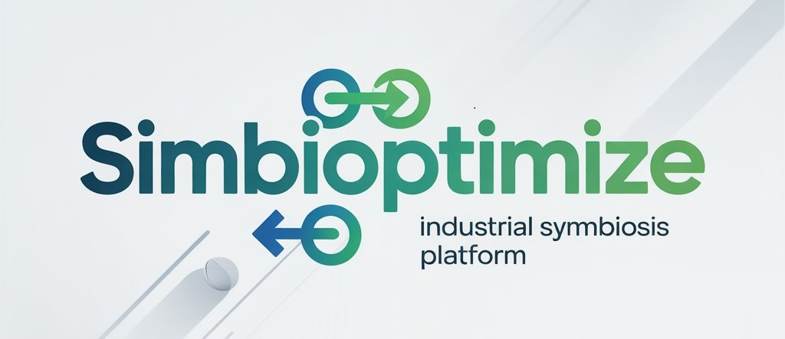

# SIMBIOPTIMIZE - Industrial Symbiosis Platform



**SIMBIOPTIMIZE** is an advanced web-based platform for optimizing industrial symbiosis networks. It enables businesses to identify and implement resource exchange opportunities that create economic and environmental value.

## 🌟 Features

- **Multi-Firm Management**: Configure up to 5 firms with geographic locations and resource profiles
- **Advanced Optimization**: Mixed-Integer Linear Programming (MILP) for optimal exchange network design
- **Monte Carlo Simulation**: Assess network robustness under uncertainty
- **Interactive Mapping**: Professional geographic visualization of resource flows
- **AI-Powered Insights**: Automated partnership recommendations and data quality analysis
- **Comprehensive User Guide**: Built-in documentation and FAQs

## 🚀 Quick Start

### Installation

1. Clone the repository:
```bash
git clone https://github.com/yourusername/simbioptimize.git
cd simbioptimize/src
```

2. Install dependencies:
```bash
pip install -r requirements.txt
```

3. Run the application:
```bash
streamlit run streamlit_app.py
```

4. Open your browser to `http://localhost:8501`

## 📋 Requirements

- Python 3.8+
- See `requirements.txt` for package dependencies

## 🏗️ Project Structure

```
src/
├── streamlit_app.py       # Main application
├── optimizer.py           # MILP optimization engine
├── montecarlo.py          # Monte Carlo simulation
├── map.py                 # Geographic visualization
├── ai.py                  # AI insights and recommendations
├── firms.py               # Firm data management
├── geo.py                 # Geographic utilities
├── model.py               # Economic models
├── cost_params.py         # Cost parameters
├── LogoSymbiosis.jpg      # Platform logo
├── mondragon.logo.png     # University logo
└── requirements.txt       # Python dependencies
```

## 💡 Usage

1. **Landing Page**: Start with an overview of the platform
2. **Firm Management**: Configure firms, locations, and resource profiles
3. **Cost Configuration**: Adjust cost parameters for your scenario
4. **Optimization**: Run MILP to find optimal exchange networks
5. **Monte Carlo**: Assess robustness under uncertainty
6. **Visualization**: Explore interactive maps and charts
7. **User Guide**: Access comprehensive documentation

## 🔬 Technology Stack

- **Framework**: Streamlit
- **Optimization**: PuLP (CBC solver)
- **Data Processing**: Pandas, NumPy
- **Visualization**: Folium, Plotly
- **Geospatial**: Haversine distance calculations

## 👤 Author

**Oscar Nieto-Cerezo**
- Institution: Mondragón Unibertsitatea
- Email: onieto@mondragon.edu
- Website: [www.mondragon.edu](https://www.mondragon.edu)

## 📄 License

This project is developed at Mondragón Unibertsitatea.

## 🤝 Contributing

For questions, suggestions, or contributions, please contact the developer.

## 📚 Documentation

Complete documentation is available within the application under the "📖 User Guide" tab.

---

© 2026 Mondragón Unibertsitatea | SIMBIOPTIMIZE v1.0
